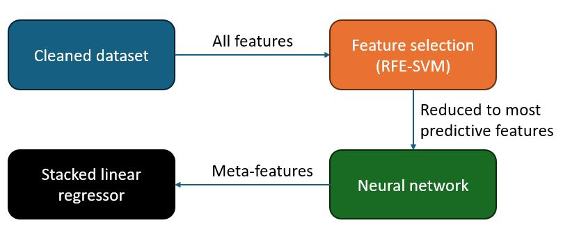
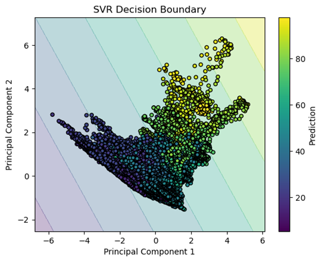
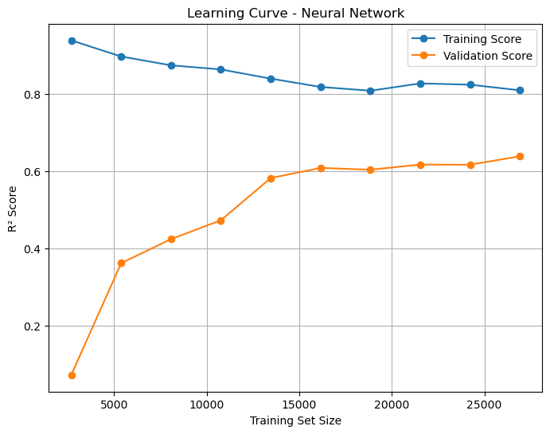
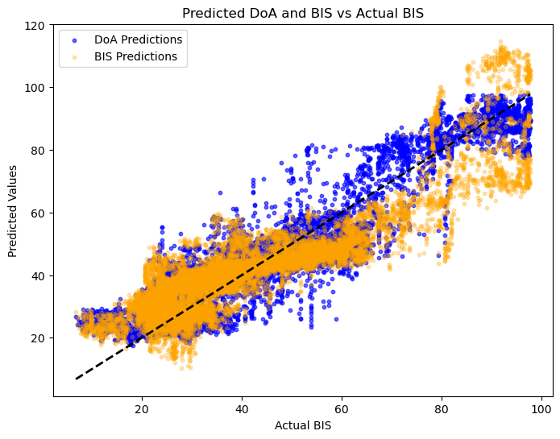
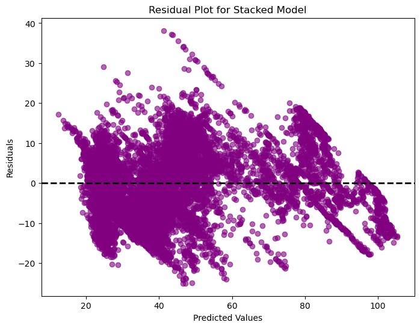
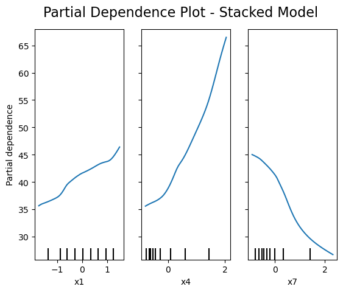

# Depth of Anaesthesia Index Development Using Machine Learning

This repository demonstrates the development of a Depth of Anaesthesia (DoA) index using supervised machine learning techniques. The project utilises EEG data to improve the benchmark BIS index, providing enhanced accuracy and reliability during surgical procedures. This work stems from a university assignment, employing advanced feature selection and predictive modelling techniques.

### Achievements:
- Improved prediction accuracy compared to the benchmark BIS index (MSE: 63.78 vs. 91.85; R²: 0.85 vs. 0.78).
- Identified the most predictive EEG features (x1, x4, and x7).
- Developed a robust stacked ensemble model combining Neural Networks and SVMs.

<div align="center">
  
</div>

## Table of Contents
1. [Project Structure](#project-structure)
2. [Dataset Description](#dataset-description)
3. [Feature Selection](#feature-selection)
4. [Neural Network Model](#neural-network-model)
5. [Stacked Regressor](#stacked-regressor)
6. [Comparative Analysis](#comparative-analysis)
7. [Tools and Libraries](#tools-and-libraries)
8. [Key Findings](#key-findings)


## Project Structure

### Data Preparation
- **Cleaning:** Removal of outliers and missing values.
- **Standardisation:** Scaling features to ensure uniformity and unbiased modelling.

### Modelling
- **RFECV-SVM:** Identifies key features for predictive modelling.
- **Neural Network:** Captures complex, non-linear relationships in the data.
- **Stacked Regressor:** Combines Neural Network and SVM outputs for improved accuracy.
- **Comparative analysis:** Testing model performance against the partitioned-off testing dataset.

### Visualisation
- **Learning Curves:** Training and validation performance analysis.
- **Scatterplots:** Comparison of predicted DoA values against BIS.
- **Residual Plots:** Assessment of prediction errors.
- **Partial Dependence Plots:** Interpret feature influence on predictions.


<div align="center">
  
</div>

***Figure 1:*** The four key stages for this project, Figure 1 shows the direction of travel for the data throughout its lifecycle.

## Dataset Description

The dataset comprises electroencephalography (EEG) data collected to estimate the Depth of Anaesthesia (DoA). It includes **12 training** sets and **5 testing sets**, each containing features extracted from EEG signals. The **target variable, `BIS`**, represents the benchmark index for evaluation.

### Dataset Schema
Each dataset contains the following columns:
- **BIS**: Bispectral index, the target variable for depth of anaesthesia.
- **x1 to x7**: Features derived from EEG signal analysis.

### Sample Data
Example structure (first three rows) of one of the 17 datasets collected from an EEG machine:

| BIS  | x1       | x2       | x3       | x4       | x5       | x6       | x7       |
|------|----------|----------|----------|----------|----------|----------|----------|
| 80.0 | 0.705208 | 1.790486 | 1.789550 | 2.090912 | 1.049270 | 0.962221 | 0.383604 |
| 80.1 | 0.709311 | 1.790486 | 1.787953 | 2.100403 | 1.051117 | 0.997764 | 0.385352 |
| 82.1 | 0.707605 | 1.790482 | 1.781845 | 2.096846 | 1.051277 | 1.005539 | 0.383615 |
| ...  | ...      | ...      | ...      | ...      | ...      | ...      | ...      |

## Feature Selection

Feature selection using RFECV with SVM reduced the dataset to three key features: **x1, x4, and x7**, minimising noise and computational complexity while enhancing model performance. SVM was chosen for its effectiveness in high-dimensional spaces and its ability to handle non-linear relationships during feature selection.

**Key Code:**
```python
from sklearn.svm import SVR
from sklearn.feature_selection import RFECV
from sklearn.model_selection import KFold

svr_model = SVR(kernel="linear")
rfecv = RFECV(estimator=svr_model, step=1, cv=KFold(n_splits=5), scoring='r2', n_jobs=-1)
rfecv.fit(X_scaled, y)
selected_features = rfecv.support_
print("Selected Features:", selected_features)
```

<div align="center">
  
</div>

***Figure 2:*** The SVR decision boundary. Overlapping or poorly defined groups result in poor predictive power and were subsequently removed.

## Neural Network Model

A Multilayer Perceptron (MLP) Neural Network was implemented with two hidden layers of 50 and 30 neurons. It utilised the ReLU activation function and early stopping to prevent overfitting. Neural Networks were selected for their capability to capture complex, non-linear relationships within the EEG data.

**Key Code:**
```python
from sklearn.neural_network import MLPRegressor

nn_model = MLPRegressor(hidden_layer_sizes=(50, 30), max_iter=1000, random_state=42,
                        early_stopping=True, validation_fraction=0.1)
nn_model.fit(X_train_selected_scaled, y_train)
```

### Neural Network Results:
- **MSE:** 64.24
- **R²:** 0.84
- **Pearson Correlation Coefficient:** 0.92

**Learning Curve:**
<div align="center">
  
</div>

***Figure 3:*** The learning curve of the R² metrics for training and validation, as the set data set size increased.


## Stacked Regressor

The final DoA index combined Neural Network and SVM predictions through a linear regression meta-model for robust outputs. The Stacked Regressor approach was used to leverage the strengths of both models, enhancing overall accuracy and providing a more reliable prediction framework.

**Key Code:**
```python
from sklearn.ensemble import StackingRegressor
from sklearn.linear_model import LinearRegression

stacking_model = StackingRegressor(
    estimators=[
        ('nn', nn_model),
        ('svr', svr_model)
    ],
    final_estimator=LinearRegression()
)
stacking_model.fit(X_train_selected_scaled, y_train)
```

### Stacked Regressor Results:
- **MSE:** 63.78
- **R²:** 0.85
- **Pearson Correlation Coefficient:** 0.92

<div align="center">
  
</div>

***Figure 4:*** The predicted DoA and BIS indices against actual BIS.

<div align="center">
  
</div>

***Figure 5:*** Residual plot for the stacked model. It is mostly random, with slight systematic patterns, confirming the model may contain a small degree of bias.


## Comparative Analysis

Performance comparison between original BIS model, the Neural Network, and the Stacked Regressor trained from the training dataset was then compared to the testing dataset. 

The Neural Network and the Stacked Regressor (even moreso) are significantly more predictive than the BIS index, with lower error.

| Model                 | MSE   | R   | Pearson Correlation |
|-----------------------|-------|------|---------------------|
| BIS                   | 91.85 | 0.78 | 0.88                |
| Neural Network        | 64.24 | 0.84 | 0.92                |
| Stacked Regressor     | **63.78** | **0.85** | **0.92**                |

**Partial Dependence Plot:**

The partial dependence plot shows the relationship of each predictive variable with the Stacked Regressor model. As features x1 and x4 share a positive relationship with the DoA, while x7 has a negative relationship with DoA.

<div align="center">
  
</div>

***Figure 6:*** In the stacked regressor model, the three most predictive variables have a combination of positive and negative affect upon the DoA.

## Tools and Libraries

- **Python:** Main programming language.
- **Pandas:** Efficient tabular data handling.
- **NumPy:** High-performance numerical computations.
- **Scikit-learn:** Machine learning model development and evaluation.
- **Matplotlib:** Data visualisation.
- **Seaborn:** Visualising statistical plots.

## Key Findings

1. RFECV-SVM reduced the features to the three most predictive, therefore increasing computation times and reducing inefficiencies in subsequent models.
2. Neural Networks captured non-linear relationships of the selected features.
3. Stacked Regressor used the meta-features from the neural network to create the most predicive model of DoA.

The Stacked Regressor significantly improved DoA prediction compared to the BIS index. Leveraging Neural Networks and SVMs, it demonstrated better accuracy and reduced error rates. These findings suggest the potential of machine learning in enhancing anaesthesia monitoring tools.
